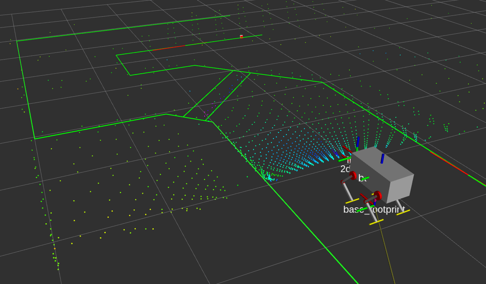

# Description

### NHK robocon 2019 ROS Package For Messenger Robot 2

NHK学生ロボコン2019のMR2用ROSパッケージ \
YVT-35LXから取得した点群情報を用いてロボットの自己位置を推定 \



# Environment

|||
|:-:|:-:|
|CPU|Core i5-6200U|
|OS   |Ubuntu 16.04 |
|ROS |Kinetic|

# How to use

YVT_35LX，オドメトリ基板(Nucleo-F446)を接続した状態で

```
roslaunch mr2_ros mr2.launch
```

を実行．

# Requirements

## ROS package

- [hokuyo3d](https://github.com/at-wat/hokuyo3d)
- [urg_node](https://github.com/ros-drivers/urg_node)
- [rosserial_python](https://github.com/ros-drivers/rosserial/tree/melodic-devel/rosserial_python)
